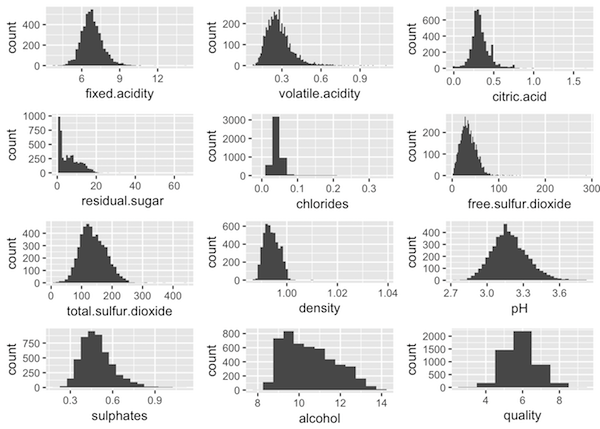
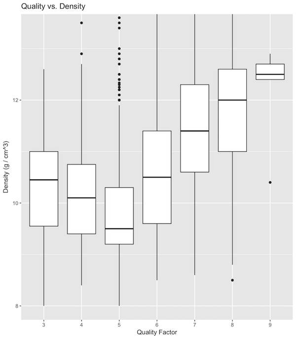
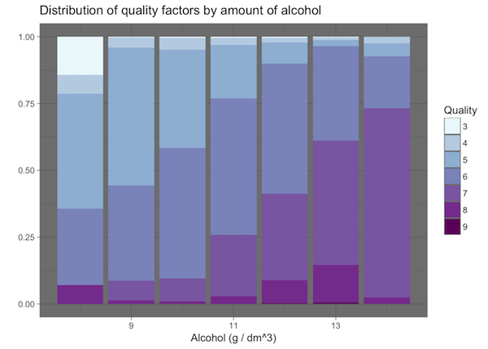

# Udacity-Data-Analyst-Nanodegree
:bar_chart: These are projects I have made for the [Udacity Data Analyst Nanodegree](https://www.udacity.com/course/data-analyst-nanodegree--nd002/).

### P1: Test a Perceptual Phenomenon - Use descriptive statistics and a statistical test to analyze the Stroop effect
This project is a descriptive analysis and test about the Stroop effect. It was implemented in RMarkdown.

### P2: Investigate a dataset: titanic
For this project the Titanic dataset provided by [kaggle.com](http://www.kaggle.com) was analyzed.
The main goal was to find factors which made people survive the accident.

Here are two example plots I created.

#### Visualization of sex and passenger class:

#### Violin plot fare vs. passenger class

The project was created with Python in a Jupyter Notebook. You can find the notebook file [here](https://github.com/Laura-O/Udacity-Data-Analyst-Nanodegree/blob/master/Project_2/P2.ipynb).

### P3: Wrangle OpenStreetMap Data
In this project, I analyzed OpenStreetMao data of the area of Paderborn, Germany. This includes the cleanup of the data, as well as some further exploration. This project was implemented in a Jupyter Notebook with Python. The data was imported into a MongoDB instance.

You can find the results [here](https://github.com/Laura-O/Udacity-Data-Analyst-Nanodegree/blob/master/Project_3/Udacity%20P3%20Project.ipynb)

### P4: Explore and summarize data
The goal of this project was to explore the relationship between several variables describing the quality and characteristics of white wine.

#### This is an overview of the given dataset:

#### Here are some more plots to visualize the data:

The project was implemented in RMarkdown. You can download the results [here](https://github.com/Laura-O/Udacity-Data-Analyst-Nanodegree/blob/master/Project_4/white_wine.html) (click on "Download", save the file locally and open it in a web browser).

